<p align="center">
  
</p>

<h1 align="center">LAZEYKA</h1>

<p align="center">
  Программа для Windows, которая собирает в одном окне обход DPI (Zapret),<br/>
  VPN на ядрах sing-box и Xray, игровой режим и прокси для Telegram.
</p>

<p align="center">
  <a href="./LICENSE"></a>
  
  
  
</p>

<p align="center">
  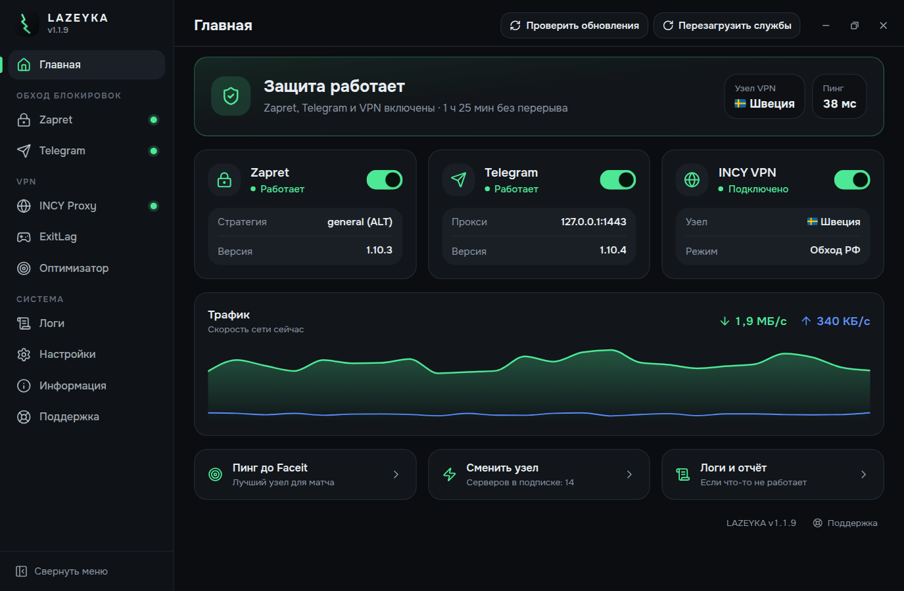
</p>

## Зачем это нужно

Сайты блокируют по-разному, и одного способа на все случаи нет. VPN меняет
IP, но режет скорость и мешает банкам и Госуслугам. Обход DPI скорость не
трогает, но открывает не всё. У Telegram свои проблемы с медиа и звонками.

LAZEYKA держит эти способы в одной программе. Начните с самого лёгкого и
добавляйте следующий, только если не хватило.

> LAZEYKA не продаёт VPN и не держит своих серверов. Для раздела INCY нужна
> ссылка на подписку от стороннего провайдера.

## С чего начать

1. Включите Zapret на вкладке «Zapret» и проверьте нужный сайт. Если не
   открылся, выберите другую стратегию из каталога или запустите
   перетестирование.
2. Если не хватило, добавьте VPN: «INCY Proxy» → «Сервера», вставьте ссылку
   на подписку или нажмите «Из буфера». Выберите сервер с зелёным пингом.
3. Если тормозит Telegram, включите его на вкладке «Telegram». Кнопка
   подключения сама передаст настройки в мессенджер.
4. Если играете, откройте «ExitLag»: через VPN пойдут только выбранные игры,
   остальной трафик Windows останется напрямую.

Включайте способы по одному и проверяйте результат после каждого. Если
запустить всё сразу и что-то сломается, будет непонятно, что виновато.

## Главная

Общий статус («Защита работает», «Работает частично» или «Всё выключено»),
узел VPN и пинг, карточки Zapret, Telegram и INCY с переключателями и график
скорости сети. В шапке две кнопки: «Проверить обновления» и «Перезагрузить
службы». Внизу быстрые переходы к пингу до Faceit, смене узла и логам.

Тема светлая или тёмная, боковое меню сворачивается в полоску иконок.

<p align="center">
  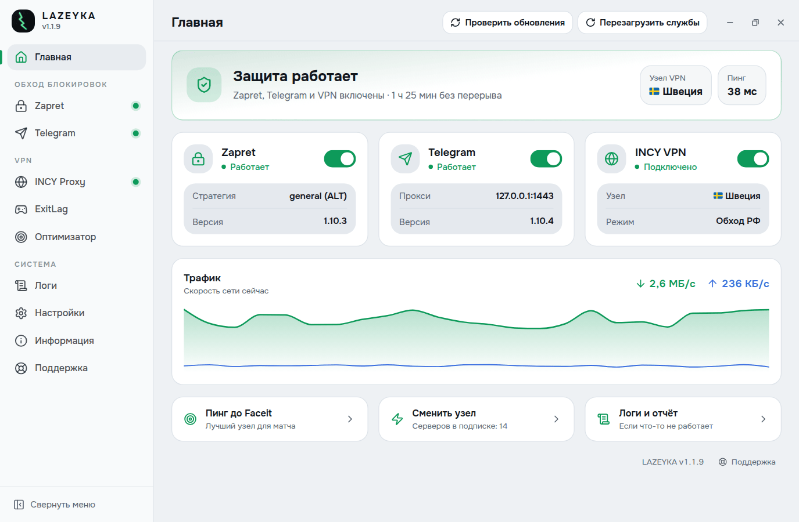
</p>

## Zapret: обход блокировок без VPN

<p align="center">
  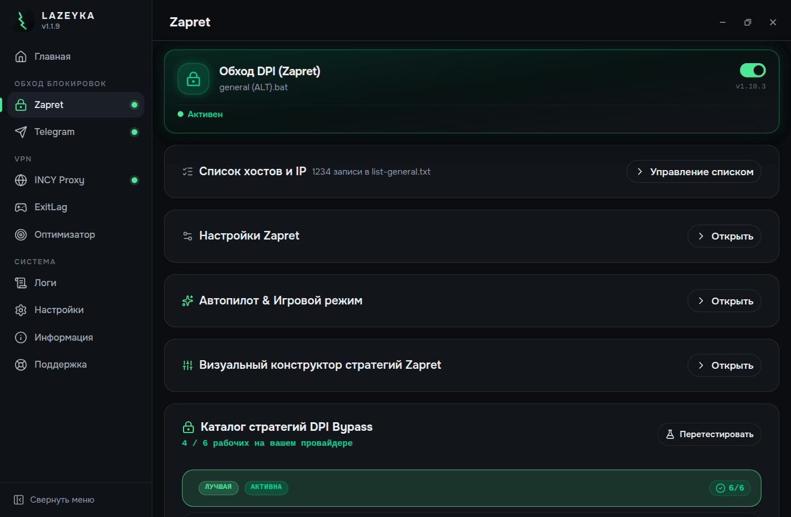
</p>

Оболочка над `winws.exe` и драйвером `WinDivert`. Трафик никуда не
перенаправляется: Zapret меняет вид запросов так, что оборудование
провайдера не узнаёт заблокированный сайт. IP остаётся вашим, скорость и
пинг в играх не меняются.

- Стратегии подобраны под разных провайдеров. Тест проверяет их все на вашей
  сети и отмечает лучшую.
- Автопилот следит за доступностью YouTube и Discord и сам меняет стратегию,
  если у провайдера что-то поменялось.
- Игровой режим замечает запуск игры и выводит её трафик из-под обработки,
  чтобы обход не добавлял пинг.
- Список хостов и IP: готовые наборы (Discord, Telegram, YouTube, Cloudflare,
  Twitch, Spotify) и полный пак от автора на 125 тысяч строк. Добавление
  дописывает к вашему списку без дублей.
- Конструктор собирает аргументы `winws.exe` вручную, если ни одна готовая
  стратегия не подошла.

## INCY: VPN на двух ядрах

<p align="center">
  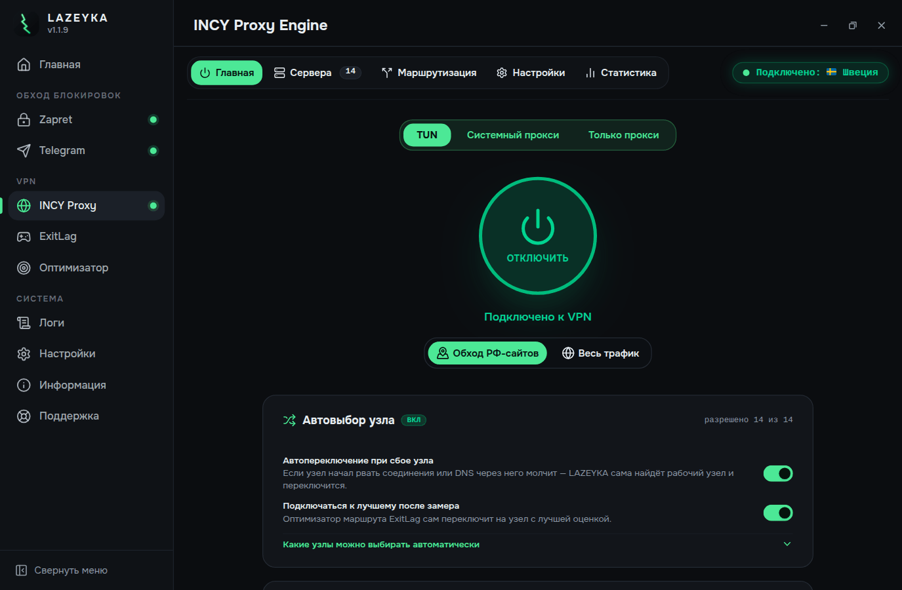
</p>

| Ядро | Что умеет |
| --- | --- |
| `sing-box` | VLESS/Reality, Hysteria2, Trojan, Shadowsocks, WireGuard (WARP), режим TUN |
| `xray` | VLESS, VMess, Trojan, Shadowsocks, фрагментация TLS ClientHello, шумовые пакеты, mux |

Ядро выбирается под узел автоматически: sing-box, Xray или связка, где
sing-box держит TUN и передаёт трафик в Xray через локальный мост.

- Три режима: TUN (весь компьютер), системный прокси (браузеры и программы,
  которые читают настройки Windows) и только прокси (локальный порт).
- Несколько подписок одновременно, у каждой своя карточка с трафиком, сроком
  и расписанием обновления. Конфигурация провайдера переносится как есть,
  поэтому работают и редкие транспорты (ws, grpc, httpupgrade, xhttp).
- Бесплатный узел Cloudflare WARP одной кнопкой.
- Пинг честный: способ «Умный» показывает задержку, только если через сервер
  реально идёт трафик. Сервер с открытым портом и упавшим VPN будет «нет
  ответа». Фильтр «Только рабочие» прячет такие серверы.
- Автовыбор узла: при сбое переключается на рабочий узел. Какие узлы можно
  выбирать автоматически, решаете вы.
- Kill Switch: если VPN оборвался, трафик, который шёл через VPN,
  блокируется до переподключения. Российские сайты и локальная сеть
  продолжают работать. Переподключение идёт само.
- Тест скорости через любой сервер: задержка, скачивание и отдача. VPN при
  этом не отключается.
- Маршрутизация: профили «Раздельно» (российские сайты напрямую),
  «Глобально» и «Напрямую», 20 гео-категорий с отдельными переключателями и
  свои правила «домен или подсеть → напрямую, туннель или блок». Свои
  правила главнее готовых списков.
- Статистика по реальным байтам из ядра, история за 14 дней.
- Резервная копия подписок, серверов, правил и настроек в один файл. Перед
  восстановлением видно, что в нём лежит.

<p align="center">
  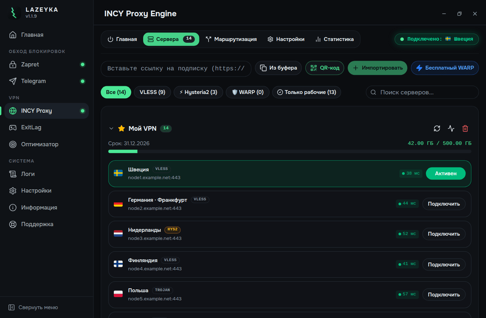
</p>

Тест скорости на главной вкладке INCY проверяет любой сервер, не отключая VPN:

<p align="center">
  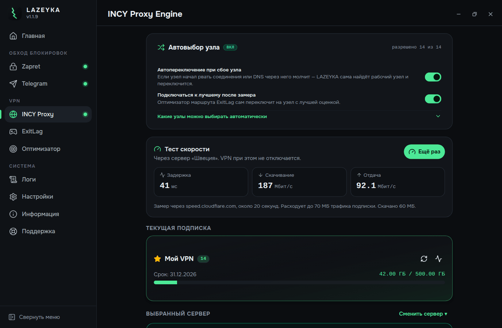
</p>

## ExitLag: VPN только для игр

<p align="center">
  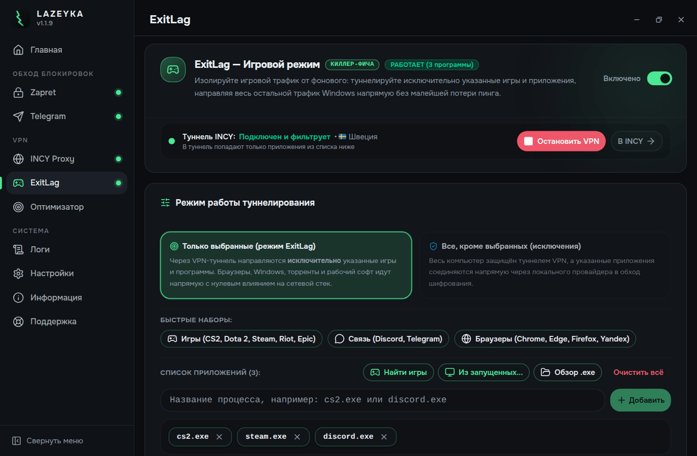
</p>

Туннелирование по приложениям в двух режимах. «Только выбранные»: через
VPN идут только указанные игры и программы, а браузеры, Windows и торренты
соединяются напрямую. «Все, кроме выбранных»: весь компьютер работает через
VPN, а указанные приложения идут в обход.

Есть готовые наборы (игры, Discord и Telegram, браузеры). Кнопка «Найти
игры» находит установленные игры Steam и Epic. Приложение можно также выбрать
из запущенных процессов, указать `.exe` через проводник или вписать имя
процесса вручную. Блок «Сейчас в сети» показывает, какие приложения из списка
выходят в интернет, через VPN или напрямую, и с какой скоростью.

<p align="center">
  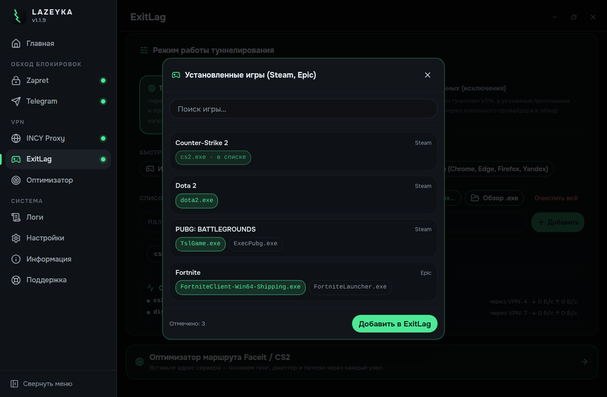
</p>

<p align="center">
  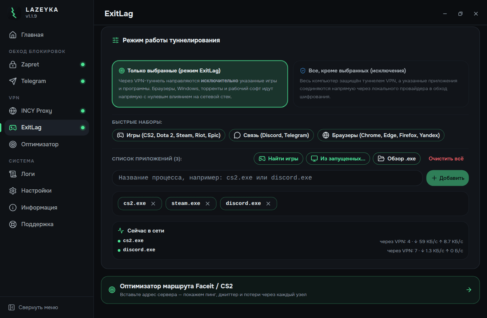
</p>

## Оптимизатор маршрута Faceit и CS2

<p align="center">
  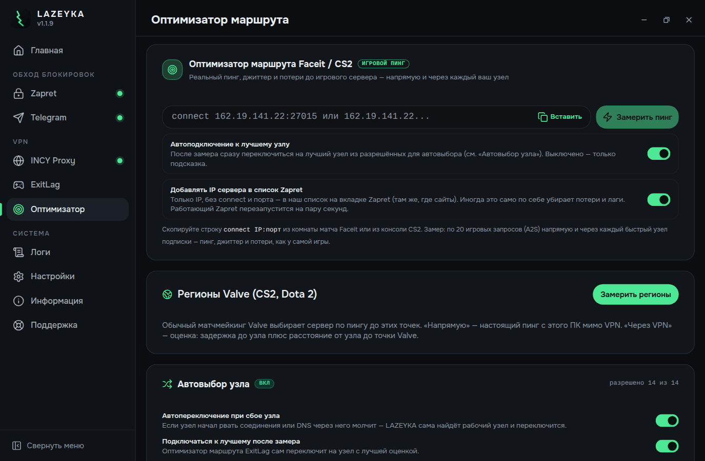
</p>

Вставьте строку `connect IP:порт` из комнаты матча Faceit или консоли CS2.
Оптимизатор отправит по 20 игровых запросов (A2S) напрямую и через каждый
быстрый узел подписки и покажет пинг, джиттер и потери, как их видит сама
игра. После замера может сам подключиться к лучшему узлу и добавить IP
сервера в список Zapret.

Для обычного матчмейкинга CS2 и Dota 2 есть таблица регионов Valve: пинг до
каждого региона напрямую и оценка через лучший узел VPN. Кнопка «Добавить в
Zapret» ничего не просит ввести: она заносит в списки Zapret всю сеть Valve
(AS32590, все её подсети) и ретрансляторы партнёров Valve из списков Steam
для CS2 и Dota 2. Для работы с игровым трафиком нужны Game Filter с UDP и
включённый IPset. Под кнопкой видно, всё ли включено, а если нет, кнопка
«Открыть настройки» переводит прямо к нужным переключателям Zapret.

<p align="center">
  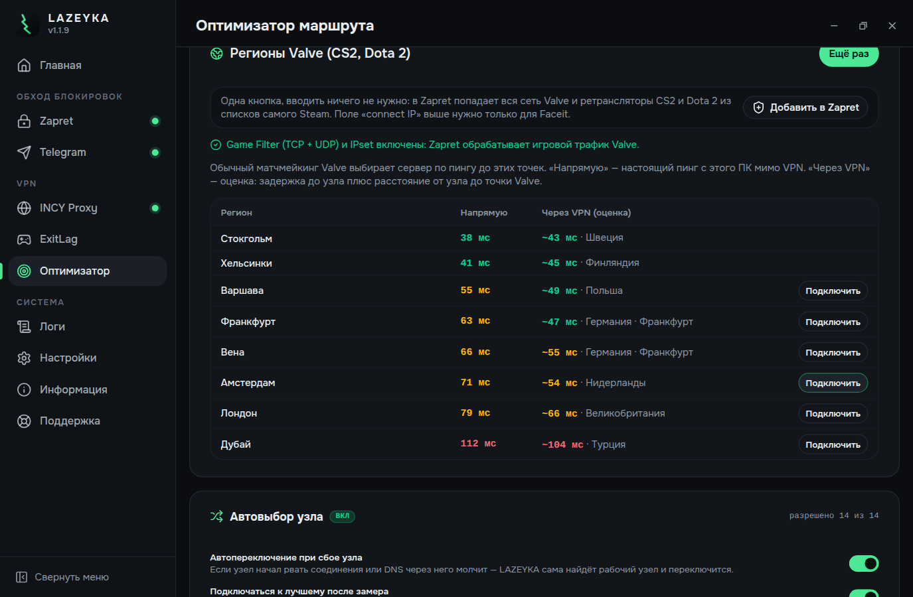
</p>

## Telegram WS-прокси

<p align="center">
  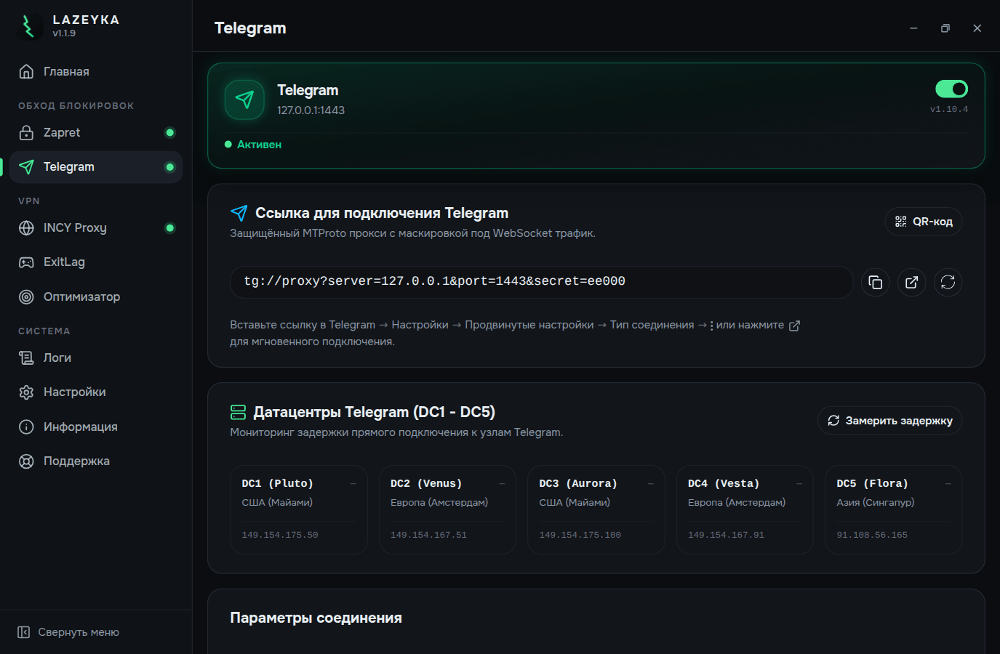
</p>

Локальный MTProto-over-WebSocket релей, отдельный прокси только для
Telegram. Работает в фоне без своих окон и значков. Ускоряет загрузку медиа
и чинит звонки, остальной интернет не трогает. Подключается в один клик
(ссылка уходит прямо в запущенный Telegram), для телефона есть QR-код. На
вкладке видна задержка до дата-центров Telegram.

Работает с Telegram Desktop и форками: AyuGram, 64Gram, Forkgram, Nekogram,
Kotatogram, Unigram.

## Настройки и остальное

<p align="center">
  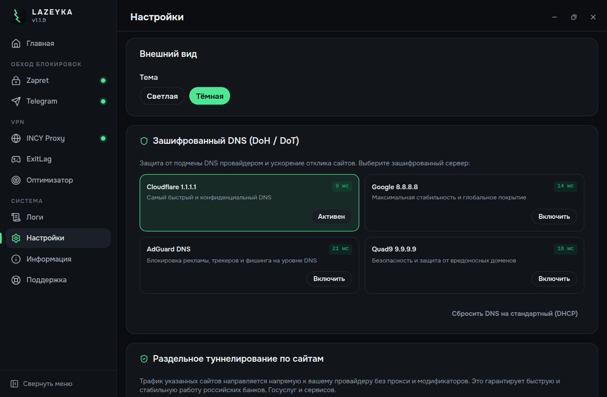
</p>

- Шифрованный DNS: Cloudflare, Google, AdGuard, Quad9 и Xbox DNS с замером
  задержки. Иногда одного этого хватает, чтобы сайт открылся.
- Раздельное туннелирование по сайтам: российские сайты, банки и Госуслуги
  идут напрямую, плюс ваши собственные исключения.
- Резервные копии всех настроек программы в файл `.lazeyka`.
- Ссылки `lazeyka://` (`connect`, `disconnect`, `toggle`, импорт подписки):
  можно сделать ярлык, который включает VPN двойным щелчком.
- Обновления: сама программа, Zapret, TgWsProxy, ядра `sing-box` и `xray`,
  гео-базы. Когда выходит новая версия, открывается окно с описанием
  изменений. Новое ядро проверяется через `sing-box check` или `xray -test`
  до замены рабочего файла, старое остаётся как `.bak`.
- Трей и автозапуск вместе с Windows, можно убрать значок с панели задач.
- Портативный режим: положите рядом с `.exe` пустой файл `PORTABLE`, и
  данные будут храниться в папке `data/` рядом с программой.

## Приватность

Настройки и логи хранятся только на вашем компьютере, в `%APPDATA%\lazeyka`
(или в `data/` в портативном режиме). Программа выходит в сеть за
обновлениями (GitHub), за гео-базами и к серверу вашей подписки. Телеметрии
нет.

При первом запуске генерируются случайный секрет для Telegram-прокси и
логин с паролем для локального прокси, так что на двух установках они
разные. В резервную копию они не попадают.

## Требования

- Windows 10 или 11 (x64).
- Права администратора. Zapret работает на уровне сетевого драйвера, а режим
  TUN создаёт виртуальный сетевой адаптер.

## Разработка

```bash
pnpm install
pnpm dev
```

В режиме разработки данные лежат в отдельной папке `%APPDATA%\lazeyka-dev`,
рабочий конфиг не затрагивается.

```bash
pnpm typecheck    # tsc для main и renderer
pnpm lint
pnpm build:win    # из консоли с правами администратора
```

Установщик собирается только на Windows: он делается через NSIS, а в
`node_modules` лежит Windows-сборка Electron.

Как выпускать релизы и как устроено автообновление: [RELEASING.md](./RELEASING.md).
Устройство программы по модулям: [docs/ARCHITECTURE.md](./docs/ARCHITECTURE.md).

### Стек

- Electron 37 и TypeScript, сборка через `electron-vite`
- React 19, Vite, Tailwind CSS 4, shadcn/ui, Radix, Lucide
- Zustand для состояния, типизированный IPC между main и renderer
- electron-builder и NSIS, установщик для всех пользователей с правами
  администратора
- PyInstaller для сборки TgWsProxy

## Лицензия и сторонние проекты

LAZEYKA распространяется под [GPL-3.0](./LICENSE).

Сетевые движки написаны не здесь, программа ими управляет. Список проектов,
их лицензии и ссылки на исходники: [THIRD-PARTY-NOTICES.md](./THIRD-PARTY-NOTICES.md).

## Поддержать проект

LAZEYKA бесплатна, и все функции доступны всем. Пожертвования ни на что в
программе не влияют. Если она вам помогла, поддержать разработку можно здесь:

- DonationAlerts: <https://www.donationalerts.com/r/reb0oorn>
- CryptoBot в Telegram: <https://t.me/send?start=IVCka2D1cl42>

## Поддержка

Вопросы, жалобы и предложения: Telegram-канал
[t.me/LAZEYKA_feedback](https://t.me/LAZEYKA_feedback).

К сообщению о проблеме приложите логи: на вкладке «Логи» очистите их,
повторите проблему и нажмите «Копировать».

## Автор

Разработка и поддержка: reb0oorn.
